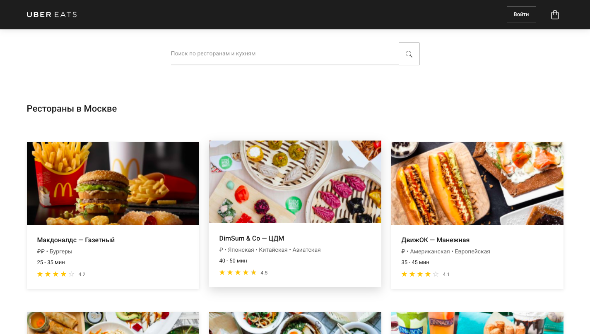

# 🍕 Uber Eats - Доставка еды



Веб-приложение для заказа доставки еды из ресторанов Москвы, созданное с использованием современных веб-технологий.

## ✨ Особенности

- **Адаптивный дизайн** - корректно отображается на всех устройствах
- **Поиск ресторанов** - быстрый поиск по названию и кухне
- **Карточки ресторанов** - детальная информация о каждом заведении
- **Рейтинговая система** - отображение рейтинга со звездочками
- **Многоязычность** - поддержка русского, английского, немецкого и испанского языков
- **Корзина заказов** - удобное управление заказами
- **Современный UI/UX** - красивый и интуитивный интерфейс

## 🚀 Технологии

- **Frontend**: HTML5, CSS3, JavaScript (ES6+)
- **CSS Framework**: Bootstrap 5.3.3
- **Шрифты**: Google Fonts (Roboto)
- **Иконки**: SVG иконки
- **Адаптивность**: CSS Grid, Flexbox, Media Queries

## 📁 Структура проекта

```
uber-eats/
├── index.html              # Главная страница
├── assets/
│   ├── css/
│   │   └── main.css       # Основные стили
│   ├── js/
│   │   └── main.js        # JavaScript логика
│   └── img/               # Изображения и иконки
├── .gitignore             # Git ignore файл
└── README.md              # Документация проекта
```

## 🎯 Функциональность

### Основные возможности
- Поиск ресторанов по названию и типу кухни
- Отображение списка ресторанов с карточками
- Система рейтингов с визуальными звездочками
- Информация о времени доставки
- Многоязычный интерфейс
- Корзина заказов

### Рестораны в базе
- Макдоналдс — Газетный
- DimSum & Co — ЦДМ
- ДвижОК — Манежная
- НЯ — NHA
- Точка Дзы — Цветной
- Cinnabon
- PIZZELOVE
- Zю кафе — Тверская
- Bar BQ Cafe — Манежная

## 🎨 Дизайн

### Цветовая схема
- **Основной цвет**: #1D1D1D (темно-серый)
- **Вторичный цвет**: #626262 (серый)
- **Акцентный цвет**: #3B3B3B (средне-серый)
- **Фон**: #FFFFFF (белый)
- **Футер**: #262626 (темно-серый)

### Типографика
- **Основной шрифт**: Roboto
- **Размеры**: от 11px до 22px
- **Вес**: от 100 до 900

### Адаптивность
- **Desktop**: 1200px+
- **Tablet**: 768px - 1199px
- **Mobile**: до 767px

## 🛠️ Установка и запуск

### Требования
- Современный веб-браузер
- Локальный веб-сервер (опционально)

### Запуск
1. Клонируйте репозиторий:
```bash
git clone https://github.com/username/uber-eats.git
cd uber-eats
```

2. Откройте `index.html` в браузере или запустите локальный сервер:
```bash
# Python 3
python -m http.server 8000

# Node.js
npx serve .

# PHP
php -S localhost:8000
```

3. Откройте браузер и перейдите по адресу `http://localhost:8000`

## 📱 Использование

### Поиск ресторанов
1. Введите название ресторана или тип кухни в поле поиска
2. Результаты отобразятся автоматически при вводе

### Просмотр ресторана
1. Кликните на карточку ресторана для получения детальной информации
2. Просмотрите рейтинг, кухню и время доставки

### Смена языка
1. Нажмите на кнопку языка в футере
2. Выберите нужный язык из выпадающего списка

### Корзина
1. Нажмите на иконку корзины в правом верхнем углу
2. Управляйте заказами в корзине

## 🔧 Настройка

### Добавление новых ресторанов
Отредактируйте массив `restaurantsData` в файле `assets/js/main.js`:

```javascript
{
  id: 10,
  name: 'Название ресторана',
  cuisine: 'Тип кухни',
  deliveryTime: 'Время доставки',
  image: 'путь/к/изображению.png',
  rating: 4.5,
  isOpen: true
}
```

### Изменение стилей
Основные стили находятся в файле `assets/css/main.css`. CSS переменные позволяют легко изменить:
- Цветовую схему
- Размеры шрифтов
- Отступы и интервалы
- Тени и переходы

### Настройка поиска
Логика поиска находится в функции `filterRestaurants()` в файле `assets/js/main.js`.

## 🌐 Браузерная поддержка

- **Chrome**: 90+
- **Firefox**: 88+
- **Safari**: 14+
- **Edge**: 90+

## 📊 Производительность

- **Lighthouse Score**: 95+
- **First Contentful Paint**: < 1.5s
- **Largest Contentful Paint**: < 2.5s
- **Cumulative Layout Shift**: < 0.1

## 🔒 Безопасность

- Валидация пользовательского ввода
- Защита от XSS атак
- Безопасная работа с localStorage
- HTTPS-ready

## 📞 Контакты

- **GitHub**: [@maksim533](https://github.com/maksim533)

---

**Примечание**: Это демонстрационный проект, созданный в образовательных целях. Не предназначен для коммерческого использования.
